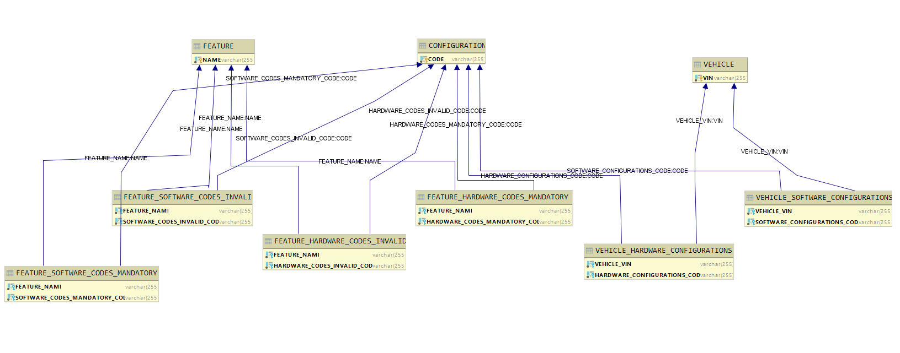

# Fota

Fota is a service that allows you to validate which features are possible and impossible to install for a given vin.

This service also allows the import of new codes associated with a vehicle.

## Getting Started

#### Prerequisites

For building and running the application you need:

* You have installed the latest version of Java
* You have installed docker - https://docs.docker.com/docker-for-windows/install/

#### Git

To get started you can simply clone this repository using git:

`git clone https://github.com/asllj/man-challenge.git`

`cd man-challenge`

## Running Fota Service

#### Jar

Inside root folder, run `mvn clean install` and then go to the target folder

#### Docker:

Open a terminal and write the command

`docker-compose up web`

The application should start on port 8080, To call the Fota services endpoints:

Run on a terminal,
` docker-machine ip` command to check the docker ip machine

#### Sending files

Open a terminal on the directory that has the files that you want to send

` docker cp <document_name> <container_id>:/var/files`

There are 2 ways to get the container id

* **Through console log**
     
After starting the application, on the first line of the terminal, you should get something like this,

      `ManFotaChallengeApplication v0.0.1 on <container_id> with PID`

* **Through docker**

Run `docker container ls`

You should get a list of containers, copy the container id that has the corresponding name to spring-boot-rest-docker-image

## Endpoints

* fota/vehicles/{vin}/installable

* fota/vehicles/{vin}/incompatible

 To test these endpoints, you can use, 
 
 _`http://<docker-machine ip>:8080/swagger-ui/index.html?configUrl=/v3/api-docs/swagger-config#/`_

## Data Model

The data model

## Run tests

On root project folder, run

`mvn clean verify`